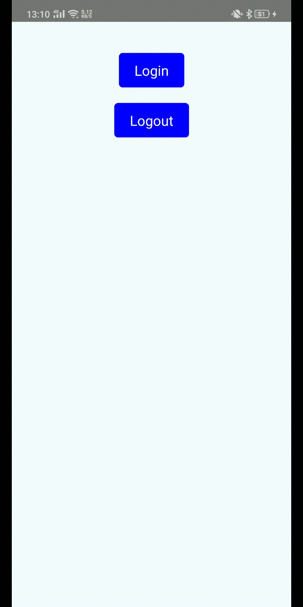
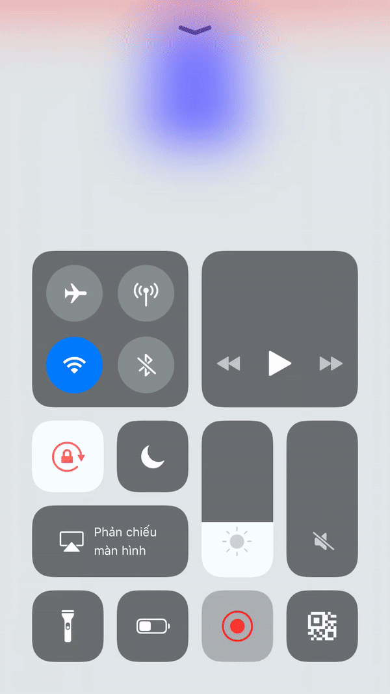

# React Native Zalo




`$ npm install rn-zalo --save`

### Mostly automatic installation

`$ react-native link rn-zalo`

### Manual installation


#### iOS

1. In XCode, in the project navigator, right click `Libraries` ➜ `Add Files to [your project's name]`
2. Go to `node_modules` ➜ `rn-zalo` and add `RNZalo.xcodeproj`
3. In XCode, in the project navigator, select your project. Add `libRNZalo.a` to your project's `Build Phases` ➜ `Link Binary With Libraries`
4. Run your project (`Cmd+R`)<

#### Android

1. Open up `android/app/src/main/java/[...]/MainApplication.java`
  - Add `import rnzalo.RNZaloPackage;` to the imports at the top of the file
  - Add `new RNZaloPackage()` to the list returned by the `getPackages()` method
  - Add `ZaloSDKApplication.wrap(this)` on "onCreate" function
2. Open up `android/app/src/main/java/[...]/MainActivity.java`
  ```
 ... 
 import android.content.Intent;
 import com.zing.zalo.zalosdk.oauth.ZaloSDK;
 import com.facebook.react.ReactActivity;
 
 public class MainActivity extends ReactActivity {
     ...
      
     @Override
     public void onActivityResult(int requestCode, int resultCode, Intent data) {
         super.onActivityResult(requestCode, resultCode, data);
         ZaloSDK.Instance.onActivityResult(this, requestCode, resultCode, data);
     }
 }

  ```
3. Append the following lines to `android/settings.gradle`:
  	```
  	include ':rn-zalo'
  	project(':rn-zalo').projectDir = new File(rootProject.projectDir, 	'../node_modules/rn-zalo/android')
  	```
4. Insert the following lines inside the dependencies block in `android/app/build.gradle`:
  	```
  	...
  	implementation "com.zing.zalo.zalosdk:core:2.4.2501"
    implementation "com.zing.zalo.zalosdk:auth:2.4.2501"
    implementation project(':rn-zalo')
  	```
5. Add appId to `android/app/src/main/res/values/strings.xml`
```
<resources>
    <string name="app_name">App Name</string>
    <string name="appID"><YOUR_APP_ID></string>
</res>
```

6. Add code bellow to `android/app/src/main/res/AndroidManifest.xml`
```
 <application
        ...
        <meta-data
            android:name="com.zing.zalo.zalosdk.appID"
            android:value="@string/appID" />

        <activity
            android:name="com.zing.zalo.zalosdk.oauth.WebLoginActivity"
            android:configChanges="orientation|screenSize"
            android:screenOrientation="sensor"
            android:theme="@style/FixThemeForLoginWebview"
            android:windowSoftInputMode="stateHidden|stateAlwaysHidden"></activity>
    </application>
```
## Usage
```javascript
import {
  StyleSheet,
  View,
  TouchableOpacity,
  Image,
  Text,
} from 'react-native';
import React from 'react';
import RNZalo from 'rn-zalo';

export default class App extends React.Component {
  constructor(props) {
    super(props);
    this.state = {
      data: null,
    };
  }

  login = async () => {
    try {
      const data = await RNZalo.login();
      this.setState({ data });
    } catch (e) {
      console.log('e', e);
    }

  };

  logout = () => {
    RNZalo.logout();
  };

  renderUser() {
    if (!this.state.data) {
      return null;
    }
    const { birthday, gender, id, picture, name } = this.state.data.user;
    return (
      <View style={styles.userInfoContainer}>
        <Text style={{ fontSize: 18, fontWeight: 'bold' }}>Name: {name}</Text>
        <Text>Id: {id}</Text>
        <Text>Birthday: {birthday}</Text>
        <Text>Gender: {gender}</Text>
        <Image
          style={{ width: 100, height: 100, borderRadius: 50, marginTop: 20 }}
          source={{ uri: picture.data.url }}
        />
      </View>
    );
  }

  render() {
    return (
      <View style={styles.container}>
        <View style={{ marginTop: 30 }}>
          <TouchableOpacity style={styles.buttonStyle} onPress={this.login}>
            <Text style={{ color: '#fff', fontSize: 18 }}>Login</Text>
          </TouchableOpacity>

          <TouchableOpacity style={styles.buttonStyle} onPress={this.logout}>
            <Text style={{ color: '#fff', fontSize: 18 }}>Logout</Text>
          </TouchableOpacity>
        </View>
        {this.renderUser()}
      </View>
    );
  }
}

const styles = StyleSheet.create({
  container: {
    flex: 1,
    backgroundColor: '#F5FCFF',
  },
  userInfoContainer: {
    flexGrow: 1,
    flexShrink: 1,
    alignItems: 'center',
  },
  buttonStyle: {
    alignSelf: 'center',
    paddingVertical: 10,
    paddingHorizontal: 20,
    backgroundColor: 'blue',
    flexDirection: 'row',
    alignItems: 'center',
    borderRadius: 5,
    marginVertical: 10,
  },
});
```
  
